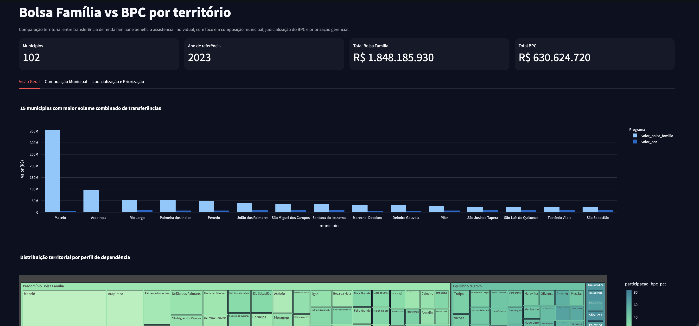

# Bolsa Família vs BPC por Território

Projeto em `Python + Streamlit` para comparar territorialmente o Bolsa Família e o Benefício de Prestação Continuada (BPC), com foco em composição municipal do gasto social, dependência relativa entre programas e judicialização do BPC.

## Para que serve

Este projeto foi desenhado para responder perguntas analíticas como:

- quais municípios dependem mais do Bolsa Família do que do BPC;
- onde o BPC tem maior peso relativo na composição do gasto social;
- quais territórios combinam alta participação do BPC com maior judicialização;
- quais municípios merecem priorização gerencial ou de controle.

## O que é comparado

### Bolsa Família

Programa de transferência de renda voltado a famílias em situação de pobreza e extrema pobreza. Neste projeto, ele entra como **componente familiar** do gasto social no território.

### BPC

Benefício assistencial previsto na LOAS, pago a idosos e pessoas com deficiência que cumpram os critérios legais. Aqui, ele entra como **componente assistencial individual**, complementando a leitura territorial.

## Dados usados

O projeto combina duas fontes:

- **Bolsa Família real**, com base pública por município de Alagoas;
- **BPC sintético calibrado**, criado a partir do schema oficial do dicionário de dados do Portal da Transparência e da mesma base territorial municipal.

Como os downloads transacionais automatizados do BPC não estavam disponíveis neste ambiente, a comparação foi estruturada com:

- `Bolsa Família` real no ano-base `2023`;
- `BPC` sintético anual para `2023`, alinhado ao território e às regras analíticas do projeto.

### O que os dados representam

O dataset final é uma tabela municipal comparativa. Cada linha representa um município de Alagoas no ano-base `2023`, consolidando:

- o valor total repassado pelo Bolsa Família;
- a quantidade estimada de famílias beneficiárias do Bolsa Família;
- o valor total estimado do BPC;
- a quantidade estimada de benefícios do BPC;
- a participação relativa de cada programa no total das transferências;
- a taxa de judicialização estimada do BPC;
- um índice sintético de priorização gerencial.

Em outras palavras, este não é um dataset individual por beneficiário. Ele é uma **camada analítica agregada por município**, pensada para leitura territorial, comparação de programas e apoio à gestão pública.

### Como o BPC sintético foi calibrado

O BPC foi gerado de forma sintética porque a extração transacional pública automatizada não estava disponível neste ambiente. Ainda assim, a geração não foi arbitrária. Ela foi construída com base em:

- o schema oficial do dicionário de dados do BPC;
- a mesma base municipal usada para o Bolsa Família;
- o salário mínimo anual do período;
- fatores territoriais e sazonais;
- uma taxa de judicialização diferenciada por município.

Isso permite reproduzir uma análise plausível de comparação territorial sem usar dados sensíveis ou restritos.

## Técnicas usadas

- `pandas`
  Para leitura, transformação, agregação e comparação dos dois programas.
- **engenharia de indicadores territoriais**
  Para calcular participação relativa, razão entre programas e pressão assistencial.
- **simulação calibrada**
  Para reproduzir um cenário plausível do BPC no mesmo território do Bolsa Família.
- `Streamlit`
  Para transformar a análise em painel interativo.
- `Plotly`
  Para visualizações de composição municipal, distribuição territorial e priorização.

## Como cada técnica foi utilizada

### 1. Integração de dados territoriais

O primeiro passo do pipeline foi integrar duas fontes com granularidade municipal:

- a base pública real do Bolsa Família por município;
- a base auxiliar de municípios de Alagoas, usada para garantir correspondência territorial com o BPC sintético.

Essa integração foi importante para permitir um comparativo coerente no mesmo nível geográfico.

### 2. Simulação calibrada do BPC

A geração sintética do BPC foi usada para reproduzir um cenário analítico realista. O pipeline:

- define um fator municipal para diferenciar o porte esperado dos municípios;
- aplica sazonalidade mensal;
- usa o salário mínimo do ano como referência de valor da parcela;
- estima uma fatia judicial para o benefício;
- agrega o resultado em nível anual.

Essa técnica foi escolhida para manter fidelidade conceitual ao benefício sem depender de uma extração transacional pública indisponível neste ambiente.

### 3. Engenharia de indicadores territoriais

Depois da consolidação dos dois programas, o projeto calcula indicadores derivados para leitura gerencial:

- `participacao_bolsa_pct`
- `participacao_bpc_pct`
- `razao_bolsa_bpc`
- `taxa_judicializacao_bpc_pct`
- `indice_pressao_assistencial`

Esses indicadores transformam valores absolutos em sinais mais úteis para priorização e interpretação.

### 4. Classificação rule-based

O projeto usa regras analíticas explícitas para classificar municípios em categorias como:

- `Predomínio Bolsa Família`
- `Predomínio BPC`
- `Equilíbrio relativo`

e também para gerar:

- `alerta_prioritario`
  com níveis `baixo`, `moderado` e `alto`.

Essa abordagem não é um modelo supervisionado de machine learning. Ela é uma técnica de classificação baseada em regras de negócio e thresholds analíticos, o que faz bastante sentido em painéis gerenciais e de controle.

### 5. Dashboard analítico

O painel em Streamlit foi pensado para uso exploratório por analistas e gestão. Ele organiza a leitura em três blocos:

- visão geral do volume total transferido;
- composição municipal entre Bolsa Família e BPC;
- judicialização e priorização gerencial.



## Bibliotecas e frameworks

### `pandas`

Foi usado como núcleo do pipeline analítico:

- leitura dos CSVs;
- transformação das bases;
- pivoteamento dos indicadores do Bolsa Família;
- merge entre programas;
- criação dos indicadores finais;
- export em `CSV`.

Escolha:

- excelente para prototipação analítica;
- fácil de manter;
- muito aderente a projetos de dados territoriais agregados.

### `numpy`

Foi usado na geração sintética do BPC, especialmente para:

- geração reprodutível com `seed`;
- distribuição dos volumes municipais;
- variação sazonal e ruído controlado.

Escolha:

- simples e eficiente para simulação calibrada;
- ajuda a reproduzir cenários com variação sem perder controle estatístico.

### `Streamlit`

Foi usado para transformar o resultado analítico em uma interface navegável.

Escolha:

- ideal para demos rápidas e painéis de portfólio;
- reduz bastante o custo de transformar uma análise em produto;
- permite mostrar valor para usuário final, e não só para equipe técnica.

### `Plotly`

Foi usado nas visualizações interativas do dashboard:

- barras empilhadas para comparar volume total;
- treemap para dependência territorial;
- scatter plots para composição percentual e judicialização.

Escolha:

- interatividade forte;
- ótima integração com Streamlit;
- muito bom para storytelling visual em análise pública.

## Indicadores gerados

- `valor_bolsa_familia`
- `valor_bpc`
- `valor_total_transferencias`
- `participacao_bolsa_pct`
- `participacao_bpc_pct`
- `razao_bolsa_bpc`
- `taxa_judicializacao_bpc_pct`
- `perfil_territorial`
- `indice_pressao_assistencial`
- `alerta_prioritario`

## Lógica analítica

1. Ler a base real de Bolsa Família por município.
2. Selecionar o ano-base `2023`, que também será usado para o comparativo com o BPC.
3. Gerar uma camada sintética anual do BPC para os mesmos municípios.
4. Consolidar os dois programas em uma mesma tabela municipal.
5. Calcular participação relativa de cada programa no território.
6. Classificar os municípios como:
   - `Predomínio Bolsa Família`
   - `Predomínio BPC`
   - `Equilíbrio relativo`
7. Construir um índice de priorização combinando:
   - volume total de transferências
   - judicialização do BPC
   - peso relativo do BPC

## Como interpretar os resultados

- `valor_total_transferencias`
  mostra o tamanho agregado do gasto social observado no município.
- `participacao_bolsa_pct`
  mede quanto do total comparado vem do Bolsa Família.
- `participacao_bpc_pct`
  mede quanto do total comparado vem do BPC.
- `razao_bolsa_bpc`
  ajuda a entender se a estrutura municipal está mais orientada para transferência familiar ou benefício assistencial individual.
- `taxa_judicializacao_bpc_pct`
  indica o peso da judicialização no conjunto estimado do BPC.
- `indice_pressao_assistencial`
  combina volume total, judicialização e peso do BPC para destacar territórios mais sensíveis.
- `alerta_prioritario`
  sintetiza a leitura em categorias acionáveis para gestão ou controle.

## Como executar

```bash
git clone https://github.com/flaviagaia/bolsa_familia_vs_BPC.git
cd bolsa_familia_vs_BPC
python3 -m venv .venv
source .venv/bin/activate
pip install -r requirements.txt
python main.py
streamlit run app.py
```

## Testes

```bash
source .venv/bin/activate
python -m unittest discover -s tests -v
```

## English

### Purpose

This project compares Bolsa Família and BPC at the municipal level, focusing on territorial composition of social spending, relative dependence on each program, and BPC judicialization.

### Data

- real Bolsa Família municipal data for Alagoas (`2023`)
- synthetic but schema-aligned BPC annual data for the same municipalities and year
- the dashboard automatically regenerates processed files if they are missing or corrupted

### What the data represents

The final dataset is a municipality-level analytical layer. Each row represents one municipality in Alagoas for the `2023` reference year, combining:

- Bolsa Família total transfers
- estimated BPC total value
- relative participation of each program
- estimated BPC judicialization rate
- a prioritization index for managerial review

### Techniques and tools

- `pandas` for data preparation and aggregation
- `numpy` for calibrated synthetic generation
- calibrated synthetic generation for BPC
- territorial indicators for program composition
- rule-based prioritization for managerial review
- `Streamlit` and `Plotly` for the dashboard


